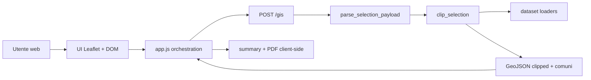
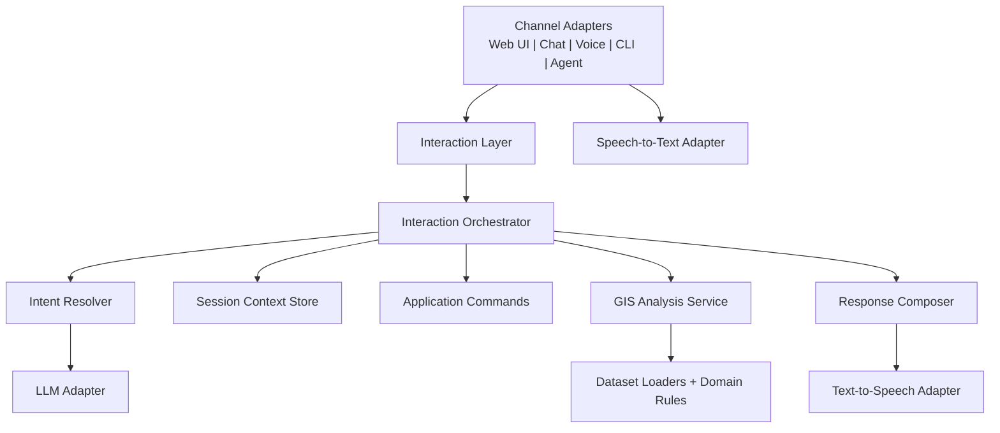

# AI Interaction Research

## Obiettivo della feature

Preparare `CartaNatura` a una nuova modalita di interazione indipendente dal canale di input, capace di supportare:

- input testuale tradizionale
- input vocale con Speech-to-Text
- risposte orchestrate da LLM
- futuro Text-to-Speech
- futuri canali client come web chat, mobile, CLI o agenti

In questa fase non viene introdotto alcun provider reale. Obiettivo: definire architettura, punti di estensione e piano incrementale senza rompere flusso GIS esistente.

## Stato attuale dell'architettura

Architettura corrente gia separa discretamente responsabilita GIS:

- [cartaNatura/views.py](/Users/matteoercolino/IdeaProjects/CartaNatura/cartaNatura/views.py:1) espone pagina principale e endpoint POST `/gis`
- [cartaNatura/services/payloads.py](/Users/matteoercolino/IdeaProjects/CartaNatura/cartaNatura/services/payloads.py:1) valida payload GeoJSON
- [cartaNatura/services/gis_clip.py](/Users/matteoercolino/IdeaProjects/CartaNatura/cartaNatura/services/gis_clip.py:1) esegue analisi GIS
- [cartaNatura/services/datasets.py](/Users/matteoercolino/IdeaProjects/CartaNatura/cartaNatura/services/datasets.py:1) carica dataset in cache
- [cartaNatura/domain/](/Users/matteoercolino/IdeaProjects/CartaNatura/cartaNatura/domain) contiene regole pure di dominio
- [cartaNatura/static/js/app.js](/Users/matteoercolino/IdeaProjects/CartaNatura/cartaNatura/static/js/app.js:1) orchestra UI, stato, API e presentazione risultati
- [cartaNatura/static/js/modules/map-controller.js](/Users/matteoercolino/IdeaProjects/CartaNatura/cartaNatura/static/js/modules/map-controller.js:1) incapsula Leaflet e selezioni mappa

### Flusso attuale



## Comprensione di interazioni, servizi, DI e flussi

### Interazioni utente

Interazione attuale nasce tutta nel browser web:

- selezione comuni
- disegno geometrie
- click su azioni UI
- ricezione risultato GIS
- sintesi report lato client

Non esiste ancora concetto di `interaction session`, `user intent`, `conversation turn` o `channel adapter`.

### Servizi applicativi

Backend espone un solo servizio applicativo esplicito: analisi GIS. Funziona bene per request/response deterministica.

Non esiste ancora servizio applicativo che:

- interpreti input utente multi-canale
- trasformi input libero in azioni applicative
- coordini LLM e GIS
- mantenga contesto conversazionale

### Iniezione dipendenze

Non esiste container DI formale. Dipendenze sono collegate tramite import diretti e costruzione esplicita:

- view -> parser -> GIS service
- `app.js` -> moduli API/analysis/map/pdf
- `MapController` istanziato direttamente nel bootstrap frontend

Per dimensione attuale progetto questo approccio e accettabile. Per introdurre AI/voice serve pero inversione dipendenze nei nuovi componenti, non necessariamente refactor completo di tutto sistema.

### Flussi di comunicazione

Comunicazione oggi e lineare:

- web UI produce payload strutturato
- backend GIS risponde con output strutturato
- frontend interpreta output e aggiorna UI

Manca livello intermedio capace di accettare input non strutturato, risolvere intento, decidere quali servizi chiamare e formattare risposta per canale.

## Limiti implementazione corrente

### Punti forti da preservare

- logica GIS backend gia isolata da Django view
- regole di dominio gia separate
- payload GIS esplicito e testabile
- frontend map logic gia separata in `MapController`

### Punti di accoppiamento che ostacolano AI-driven interaction

1. `app.js` concentra orchestration UI, stato sessione, analisi, feedback utente e presentazione. Nuovi canali non possono riusare facilmente questo flusso.
2. Contratto `/gis` presuppone input gia normalizzato in GeoJSON. Un LLM o input vocale produce invece testo libero, intenti e slot incompleti.
3. Nessun livello applicativo rappresenta comando utente astratto come `AnalyzeMunicipalities`, `AnalyzeDrawnArea`, `ExplainResult`, `EstimateEconomicValue`.
4. Nessun adapter separa canale, trascrizione, interpretazione intento e invocazione servizi.
5. Stato analisi vive quasi tutto lato client. Un canale vocale o agente richiedera stato condiviso o serializzabile.
6. Output oggi e pensato per mappa + popup HTML. Un canale voce o chat richiede risposta strutturata multi-formato.

## Valutazione refactoring necessario

Refactoring immediato non strettamente necessario sul codice esistente.

Motivazione:

- core GIS gia abbastanza modulare
- introdurre ora interfacce o adapter non usati aumenterebbe superficie morta
- valore maggiore, in questa fase, sta nel definire chiari boundary per prossimi step

Decisione per branch `research`:

- nessun refactoring runtime
- nessuna modifica al comportamento esistente
- sola documentazione tecnica e piano architetturale

## Proposta architetturale

Introdurre un `Interaction Layer` sopra servizi GIS esistenti e sotto i canali client.

### Principi

- canale indipendente da dominio
- servizi GIS riusabili senza conoscere LLM o voce
- interpretazione intento separata da esecuzione azione
- risposta applicativa strutturata, poi resa dal canale
- provider esterni dietro adapter e interfacce

### Layer target



## Componenti da introdurre

### 1. Channel Adapter

Responsabilita:

- ricevere input da canale specifico
- convertirlo in `InteractionRequest`
- inviare `InteractionResponse` a presenter/render locale

Esempi:

- `WebMapInteractionAdapter`
- `WebChatInteractionAdapter`
- `VoiceInteractionAdapter`
- `CliInteractionAdapter`

### 2. Interaction Request / Response model

Contratti applicativi neutrali rispetto al canale.

Esempio concettuale:

```text
InteractionRequest
  - channel
  - session_id
  - user_id? 
  - input:
      - text?
      - transcript?
      - geo_selection?
      - attachments?
  - context:
      - previous_result?
      - current_map_extent?
      - selected_municipalities?

InteractionResponse
  - messages[]
  - commands[]
  - analysis_result?
  - ui_hints?
  - audio_output_text?
```

### 3. Interaction Orchestrator

Use case layer. Coordina:

- validazione request
- risoluzione intento
- chiamata servizi applicativi
- composizione risposta finale

Non deve contenere codice provider-specifico.

### 4. Intent Resolver

Responsabilita:

- classificare intento
- estrarre parametri
- capire se richiesta richiede chiarimento

Modalita possibili:

- rule-based per intenti semplici
- LLM-assisted per linguaggio naturale
- ibrida: regole prima, LLM fallback

### 5. Application Commands

Comandi espliciti. Esempi:

- `AnalyzeSelectionCommand`
- `AnalyzeMunicipalitiesByNameCommand`
- `ExplainAnalysisCommand`
- `EstimateEconomicValueCommand`
- `ResetSessionCommand`

Questi comandi invocano servizi esistenti o futuri senza conoscere canale.

### 6. Session Context Store

Necessario per chat/voice multi-turn.

Responsabilita:

- memorizzare selezioni correnti
- tenere ultimo risultato GIS
- supportare chiarimenti tipo "rifai solo per Avellino"

Prima versione puo usare sessione Django o store in-memory. Versioni future: Redis o DB dedicato.

### 7. Response Composer

Genera output strutturato per piu modalita:

- testo leggibile
- dati strutturati per UI
- prompt TTS-safe
- eventuali azioni UI suggerite

### 8. Provider Adapters

Interfacce minime per dipendenze esterne:

- `LlmProvider`
- `SpeechToTextProvider`
- `TextToSpeechProvider`

Implementazioni concrete future:

- OpenAI
- Azure OpenAI
- Anthropic
- local models
- Whisper / Azure Speech / Google Speech
- ElevenLabs / Azure TTS / OpenAI audio

## Compatibilita con architettura corrente

Servizi esistenti possono restare quasi invariati.

Mappa di riuso:

- `parse_selection_payload` resta utile per input gia strutturato
- `clip_selection` resta core use case GIS
- `serialize_categories` resta sorgente dati per UI e, in futuro, per grounding LLM
- `MapController` resta adapter di canale web-mappa, non deve diventare orchestratore AI

Principale nuova estrazione futura:

- spostare orchestration di alto livello fuori da `app.js`
- introdurre endpoint nuovo, separato da `/gis`, per interazione conversazionale o multimodale

## Possibili integrazioni con provider LLM

### Ruoli possibili LLM

- interpretazione linguaggio naturale
- generazione risposta testuale
- riassunto risultati GIS
- richiesta chiarimenti quando input ambiguo
- eventuale tool-calling verso use case GIS

### Pattern consigliato

- usare LLM come adapter periferico, non come dominio
- mantenere GIS deterministico fuori da prompt
- passare a LLM solo contesto minimo e dati strutturati
- usare output schema-validato per intenti/slot

### Provider candidati

- OpenAI: function calling, structured output, STT/TTS integrabili stesso ecosistema
- Azure OpenAI: opzione enterprise/compliance
- Anthropic: buona qualita reasoning, da abbinare a STT/TTS separati
- modelli locali: utile per sperimentazione offline, ma piu complessi per voce e qualita NL

## Possibili integrazioni Speech-to-Text e Text-to-Speech

### Speech-to-Text

Possibili ingressi:

- dettatura singolo comando
- conversazione multi-turn
- comando vocale associato a selezione mappa gia presente

Provider candidati:

- OpenAI speech transcription
- Whisper locale
- Azure Speech
- Google Speech-to-Text

Requisiti architetturali:

- supporto `audio` come input opzionale
- trascrizione prima di intent resolution
- metadati su confidenza trascrizione
- possibilita di chiedere conferma utente

### Text-to-Speech

Uso futuro:

- lettura sintesi analisi
- conferma operazioni
- accessibilita

Provider candidati:

- OpenAI audio generation
- Azure TTS
- ElevenLabs

Requisiti architetturali:

- `InteractionResponse` deve separare contenuto semantico da rendering audio
- composer deve produrre testo TTS-safe piu breve del report HTML

## Piano di implementazione incrementale

### Fase 1: preparazione architetturale

Obiettivi:

- introdurre modelli `InteractionRequest` / `InteractionResponse`
- definire orchestrator e interfacce provider
- isolare orchestration alto livello dal solo `app.js`
- definire session context serializzabile

Output attesi:

- nuovo package applicativo `interaction/`
- test unitari su request/response e intent routing base
- nessun cambio funzionale utente finale

### Fase 2: supporto LLM testuale

Obiettivi:

- aggiungere endpoint conversazionale separato
- supportare input testuale come "analizza Avellino e Benevento"
- risolvere intenti testuali in comandi applicativi
- restituire risposta testuale + eventuali dati strutturati

Output attesi:

- primo `LlmProvider` dietro interfaccia
- prompt grounding con categorie e regole GIS
- fallback rule-based per richieste semplici

### Fase 3: supporto Speech-to-Text

Obiettivi:

- accettare audio input
- trascrivere e inoltrare al medesimo orchestrator testuale
- gestire conferma quando confidenza bassa

Output attesi:

- `SpeechToTextProvider`
- pipeline `audio -> transcript -> intent -> command`
- log metadati latenza e confidenza

### Fase 4: supporto Text-to-Speech

Obiettivi:

- produrre risposta audio da sintesi strutturata
- esporre toggle accessibilita o voice mode

Output attesi:

- `TextToSpeechProvider`
- strategia per risposta breve/parlata vs report completo

### Fase 5: ottimizzazioni e osservabilita

Obiettivi:

- tracing per turn, provider call, GIS latency
- metriche su errori, ambiguity rate, token cost, speech confidence
- caching e degradazione controllata quando provider esterni non disponibili

Output attesi:

- dashboard osservabilita
- timeout/retry policy
- fallback manuali verso flusso GIS classico

## Rischi e trade-off

1. Complessita conversazionale. Multi-turn e chiarimenti possono crescere molto piu del core GIS.
2. Ambiguita input. Nomi comuni, sinonimi e riferimenti deittici come "quello prima" richiedono stato robusto.
3. Costi e latenza provider. LLM/STT/TTS aggiungono dipendenze esterne e tempi di risposta.
4. Privacy. Audio e testo possono introdurre dati sensibili; servono policy chiare.
5. Duplicazione UX. Web map, chat e voice possono divergere se response model non resta unico.
6. Testabilita. Logica LLM va tenuta dietro contratti per essere mockabile.

## Trade-off chiave di design

- `LLM-first` non consigliato. Meglio `domain-first` con LLM come interprete/adattatore.
- sessione server-side utile per voice/chat, ma aumenta stato applicativo.
- response model unico costa di piu all'inizio, ma evita duplicazioni future.

## Criteri di accettazione

Ricerca considerata pronta quando:

- esiste chiara separazione concettuale tra canale, orchestrazione, comandi applicativi e provider
- servizi GIS correnti restano riusabili senza dipendenze da LLM/voice
- roadmap incrementale consente rilascio senza regressioni del flusso web attuale
- futuro supporto voice riusa stesso orchestrator del supporto text
- provider LLM/STT/TTS possono essere sostituiti tramite adapter
- sistema puo degradare verso comportamento classico se provider esterni falliscono

## Raccomandazione finale

Prossimo step pratico: implementare solo Fase 1 con scaffolding minimo e test, senza UI conversazionale pubblica e senza provider reali.

Questo mantiene branch di sviluppo pulito:

- GIS core invariato
- feature flaggabile
- base pronta per iterare su text-first, poi voice
