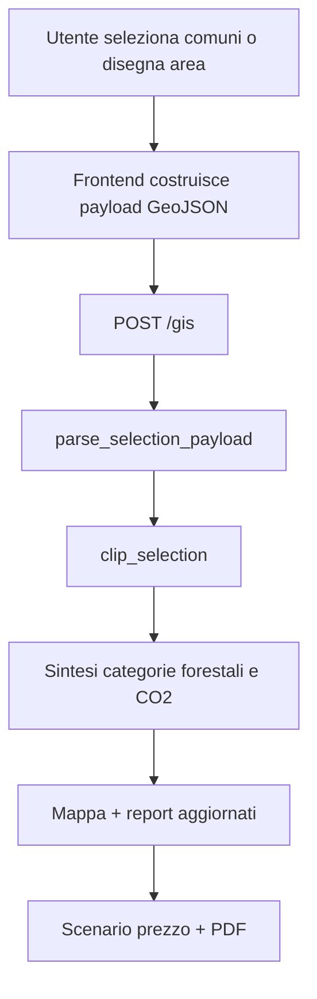
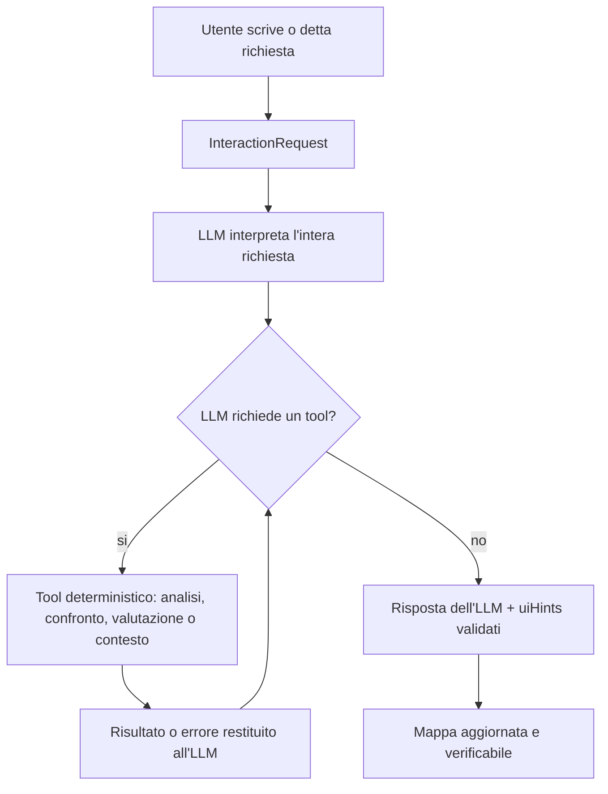

# Architettura

## Scopo

`CartaNatura` è un sistema WebGIS per supportare analisi e valutazione economica del servizio ecosistemico di sequestro forestale della CO2. Interfaccia mappa, conversazione, voce e report condividono gli stessi servizi analitici; una telemetria raw separata osserva il runtime senza gestire lo studio.

## Moduli

```text
Browser
  -> Leaflet map workspace
  -> conversational panel
  -> voice input
  -> report/PDF
  -> raw telemetry client (solo eventi browser-authoritative)

Django
  -> views.py
  -> domain/
  -> services/
  -> interaction/
  -> telemetry.py

Dataset locali
  -> shapeCN/CNPulita.shp
  -> static/data/*.geojson
```

## Separazione Responsabilità

### WebGIS e Mappa

- [static/js/modules/map-controller.js](/Users/matteoercolino/IdeaProjects/CartaNatura/cartaNatura/static/js/modules/map-controller.js:1)
- selezione comuni
- disegno, modifica e rimozione geometrie
- rendering categorie forestali e comuni interessati
- verifica spaziale dei risultati

### Analisi Spaziale

- [services/payloads.py](/Users/matteoercolino/IdeaProjects/CartaNatura/cartaNatura/services/payloads.py:1)
- [services/datasets.py](/Users/matteoercolino/IdeaProjects/CartaNatura/cartaNatura/services/datasets.py:1)
- [services/gis_clip.py](/Users/matteoercolino/IdeaProjects/CartaNatura/cartaNatura/services/gis_clip.py:1)
- validazione payload GeoJSON
- conversione CRS
- clip tra selezione e Carta della Natura
- comuni interessati

### CO2 Sequestrata

- [domain/vegetation.py](/Users/matteoercolino/IdeaProjects/CartaNatura/cartaNatura/domain/vegetation.py:1)
- coefficienti per categoria forestale
- serializzazione categorie per frontend
- sintesi server/client coerente

### Valutazione Economica

- scenari prezzo configurati in [views.py](/Users/matteoercolino/IdeaProjects/CartaNatura/cartaNatura/views.py:47)
- calcolo lato client: prezzo EUR/t moltiplicato per CO2 annua stimata
- evento raw `economic_evaluation`

### Interfaccia Conversazionale

- [interaction/models.py](/Users/matteoercolino/IdeaProjects/CartaNatura/cartaNatura/interaction/models.py:1)
- [interaction/resolvers.py](/Users/matteoercolino/IdeaProjects/CartaNatura/cartaNatura/interaction/resolvers.py:1)
- [interaction/orchestrator.py](/Users/matteoercolino/IdeaProjects/CartaNatura/cartaNatura/interaction/orchestrator.py:1)
- [interaction/assistant_runtime.py](/Users/matteoercolino/IdeaProjects/CartaNatura/cartaNatura/interaction/assistant_runtime.py:1)
- intenti di dominio
- interpretazione e pianificazione delle richieste testuali/vocali sempre affidate all'LLM
- calcoli e modifiche allo stato eseguiti esclusivamente dai tool
- runtime LLM provider-neutral con tool use
- stato conversazionale in sessione Django

### Supporto Vocale

- `MediaRecorder` nel browser acquisisce un messaggio audio breve
- Django invia audio a OpenAI Audio Transcriptions
- il transcript torna al frontend e viene inviato allo stesso endpoint conversazionale
- channel `voice`, metadata `interactionMode=voice`
- transcript nel log backend correlato; audio raw non persistito

### Report

- [static/js/modules/pdf-export.js](/Users/matteoercolino/IdeaProjects/CartaNatura/cartaNatura/static/js/modules/pdf-export.js:1)
- report HTML nel pannello laterale
- PDF con mappa, CO2, superficie, categoria prevalente, scenario prezzo, valore stimato, comuni interessati
- evento `pdf_generated`

### Telemetria Raw

- [telemetry.py](/Users/matteoercolino/IdeaProjects/CartaNatura/cartaNatura/telemetry.py:1)
- JSONL append-only per sessione anonima, con lock concorrente
- nessun participant/task lifecycle, export o summary derivato
- backend autorevole per testo, transcript, risposta, tool e risultati strutturati
- frontend autorevole soltanto per azioni GUI e risultati client-side
- niente audio raw, IP, user-agent o identificativi personali

## Flusso WebGIS



## Flusso Conversazionale



## Regole

- Numeri GIS e CO2 arrivano solo da servizi deterministici.
- OpenAI interpreta ogni richiesta testuale o transcript, guida il workflow e sintetizza i risultati; gli endpoint ASITA rifiutano provider diversi.
- Modello, base URL, timeout e identificativi di turno sono isolati nel layer `interaction/llm.py`; Ollama resta fuori dal percorso sperimentale e non è un fallback.
- Ogni risultato prodotto dalla conversazione deve restare verificabile su mappa.
- Le view Django restano sottili.
- I dataset locali sono caricati con caching.
- CRS critici:
  - comuni UI: `EPSG:32633`
  - disegni mappa: `EPSG:4326`
  - analisi finale: conversione coerente prima del clip
