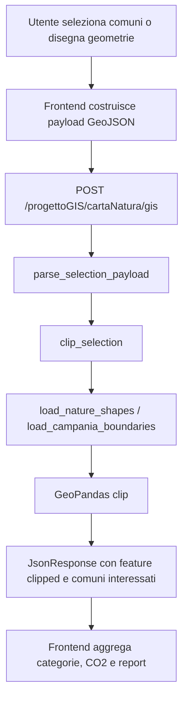

# Architettura

## Obiettivo

`CartaNatura` è una web app GIS che consente di:

- selezionare comuni della Campania
- disegnare poligoni o rettangoli in mappa
- intersecare la selezione con il dataset Carta della Natura
- sintetizzare superficie, categorie vegetazionali, CO2 annua e valore economico

## Vista ad alto livello

```text
Browser
  -> Leaflet UI
  -> selezione comuni / geometrie
  -> POST /progettoGIS/cartaNatura/gis

Django
  -> views.py
  -> services/payloads.py
  -> services/gis_clip.py
  -> services/datasets.py
  -> domain/*

Dataset locali
  -> shapeCN/CNPulita.shp
  -> static/util/moddedCampania.geojson
  -> static/data/*.geojson
```

## Layer applicativi

### `progettoGIS/`

Contiene il contenitore Django:

- `settings.py`
- `urls.py`
- `wsgi.py`
- `asgi.py`

Non contiene logica di dominio.

### `cartaNatura/views.py`

Responsabilità:

- render della pagina principale
- iniezione config frontend
- endpoint POST `/gis`
- orchestrazione tra parsing payload e servizio GIS

Le view devono restare sottili.

### `cartaNatura/services/`

Responsabilità:

- `payloads.py`: valida e normalizza la richiesta del client
- `datasets.py`: carica in cache i dataset GIS locali
- `gis_clip.py`: converte le aree in `GeoDataFrame`, applica il clip e restituisce il risultato

Qui vive la logica applicativa GIS.

### `cartaNatura/domain/`

Responsabilità:

- `vegetation.py`: categorie vegetazionali, mapping codice -> categoria, coefficienti CO2
- `municipalities.py`: regole sui comuni e filtri di business

Qui vivono regole pure, senza dipendenze Django.

### `cartaNatura/static/js/`

Responsabilità:

- bootstrap frontend
- gestione mappa
- chiamate API
- aggregazione analisi lato client
- export PDF

La logica è divisa in moduli e non più in un singolo file monolitico con GeoJSON embedded.

## Flusso richiesta



## Coordinate systems

Il progetto usa CRS diversi a seconda della sorgente:

- comuni selezionati: `EPSG:32633`
- geometrie disegnate in mappa: `EPSG:4326`
- analisi GIS finale: conversione a `EPSG:4326`

Questo punto è critico: ogni modifica GIS deve essere verificata rispetto alla coerenza dei CRS.

## Datasets

### `cartaNatura/shapeCN/CNPulita.*`

Shapefile sorgente della Carta della Natura usato per il clip.

### `cartaNatura/static/util/moddedCampania.geojson`

Confini comunali usati per ricavare i comuni interessati da geometrie disegnate.

### `cartaNatura/static/data/*.geojson`

Dataset client-side ottimizzati per la UI:

- comuni Campania in `32633`
- boundaries in `4326`

## Convenzioni architetturali

- Le view non devono contenere business logic GIS.
- Le costanti di dominio devono vivere in `domain/`, non duplicate tra Python e JS quando evitabile.
- I dataset locali devono essere caricati con caching.
- Il frontend deve parlare con il backend tramite path relativi e config iniettata dal server.
- Il repository deve restare operabile in locale senza dipendenze da servizi GIS esterni.

## Debito tecnico residuo

- separare ulteriormente il report PDF dal bootstrap applicativo
- coprire più edge-case GIS nei test
- alleggerire ulteriormente gli asset statici residui
- introdurre eventualmente un formato dati più efficiente per alcuni layer grandi
